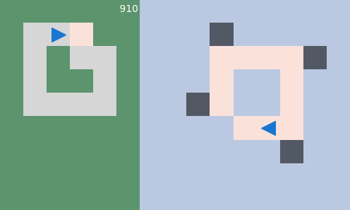
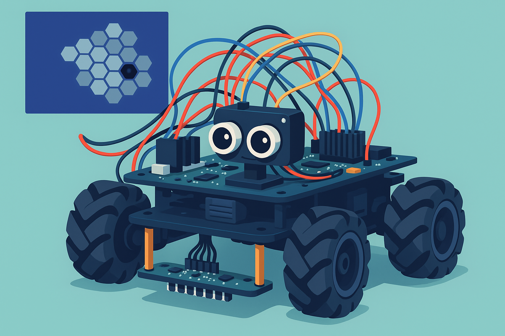

# Welcome to Petite IA's home page!

We pioneer algorithms empowering autonomous robots to generate life-like behaviors

## The Interactional Motivation Tutorial

[source](https://github.com/PetiteIA/schema_mechanism)

## The Petitcat project

A robot driven by interactinal motivation that learns to master its sensorimotor apparatus through playing. 

[source](https://github.com/PetiteIA/petitcat)
